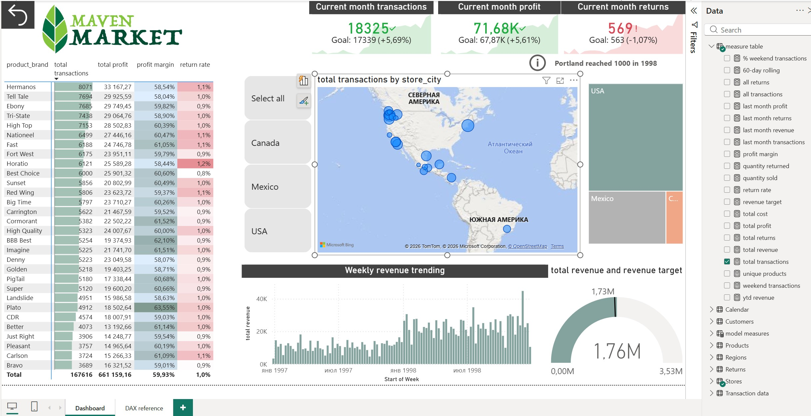

# Maven Market — Retail Sales Dashboard

Power BI dashboard analyzing retail transactions across stores, products, 
and time periods using the Maven Market dataset.

## Dashboard Preview



## What it shows

- Revenue, profit, and returns tracked against monthly targets (KPI cards with trend lines)
- Weekly revenue trend over a two-year period
- Geographic breakdown of transactions by store location (map + treemap by country/state/city)
- Product brand performance — total transactions, profit, profit margin, and return rate (pivot table)
- Country-level slicer for filtering all visuals

## Key DAX measures

```dax
ytd revenue = CALCULATE([total revenue], DATESYTD('Calendar'[date]))

60-day rolling = CALCULATE([total revenue], 
    DATESINPERIOD('Calendar'[date], MAX('Calendar'[date]), -60, DAY))

last month revenue = CALCULATE([total revenue], DATEADD('Calendar'[date], -1, MONTH))

return rate = [quantity returned] / [quantity sold]

profit margin = [total profit] / [total revenue]

revenue target = [last month revenue] * 1.05
```

A full reference of all measures with formulas is included on the second page of the report ("DAX reference").

## Data model

Star schema with one fact table and supporting dimensions:
- **Transaction data** (fact) — sales transactions
- **Returns** (fact) — product returns
- **Products**, **Stores**, **Customers**, **Calendar**, **Regions** (dimensions)

## How to open

Requires [Power BI Desktop](https://powerbi.microsoft.com/desktop/) (free, Windows only).
Download the `.pbix` file and open locally.
